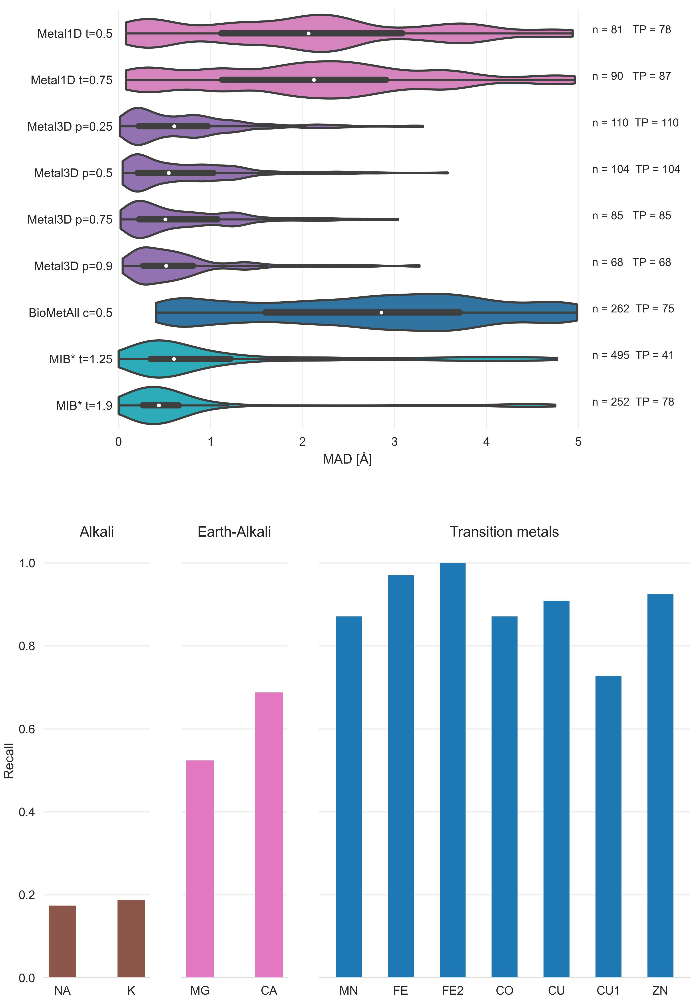
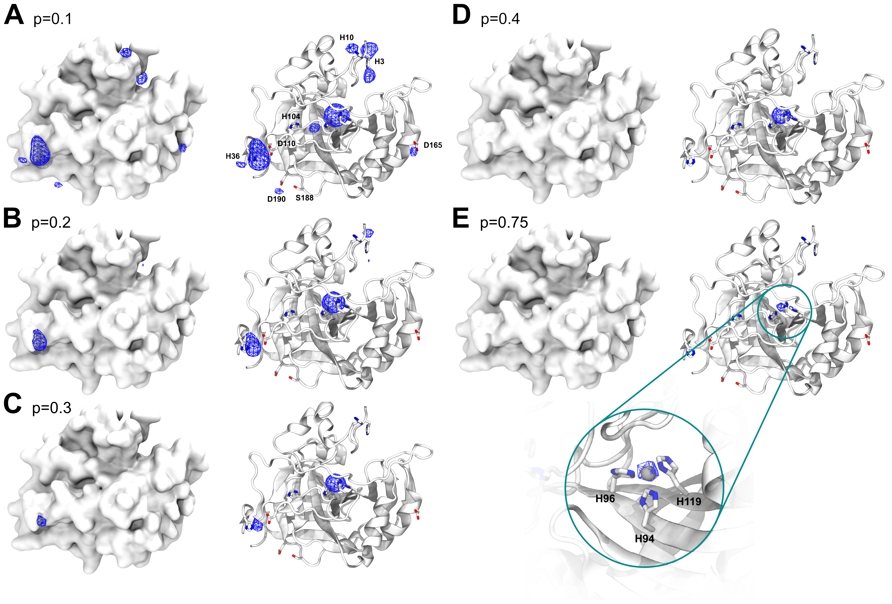

## Results

The dataset used for all training and analysis was obtained from the RCSB Protein Data Bank [@doi:10.1093/nar/28.1.235]. We used the clustered PDB at 30% sequence identity to remove similar structures and used the highest resolution structure from each cluster that contained a zinc, did not contain DNA/RNA and had resolution < 2.5 Å. In case no structure was found the cluster was discarded for the training of the models. 

### Metal1D
The statistical analysis for the distance based model uses the `LINK` records present in deposited PDB structures. These training set structures are used to generate a probability map for the coordinating amino acids. In inference mode, the map is used to predict metal sites: for a given protein structure, each amino acid of the protein is scored based on the probability map, performing a geometrical search around the amino acid. For zinc, the average `LINK` distance found in the training set was 2.2 ± 0.2 Å, and the default search radius was set to 5.5 Å. 

Once all amino acids in the chain are scored, site predictions are made grouping the highest-scored amino acids in clusters, based on distance (using twice the search radius as cutoff). For each cluster, a site prediction is made as a weighted average between the coordinates of the reference point of each amino acid, using as weighting factor the amino acid score.  The likelihood of each predicted metal site is assessed based on surrounding amino acids, in order to sort the predicted site with respect to the probability. This reduces possible artefacts originating from sites that are placed in positions with a low-probable coordinating environment. 

Metal1D is available as self-contained notebook on Google Colab. 

### Metal3D

The training examples were sampled from the chosen structures by choosing a balanced number of environments from each protein that contain or do not contain a zinc within 12 Å of the central residue. Each box was randomly rotated such that the model becomes insensitive to rotation. Metal3D predicts a per residue probability density in a box centered around the Cɑ atom of a residue that can then be averaged over all residues or used individually (e.g for protein design). The best parameters chosen using hyperparameter tuning were XXXXXX. 

We evaluated the quality of the model by using the discretized Jaccard index (similarity of two sets) on the test set. We noticed that at the edges often spurious density is predicted so we evaluated the similarity of the test set metal density and the predicted metal probability density removing the outer edge of the boxes.
Figure @fig:jaccard shows that the similarity of the boxes does not depend much on the probability cutoff chosen with higher cutoffs yielding slightly higher Jaccard similarity values (0.02  - 0.04 difference between p=0.5 and p=0.9). Reducing the size of the analyzed boxes (i.e trimming of the edges) has a much more drastic influence on the Jaccard index increasing the Jaccard similarity from ≈ 0.64 to 0.88 showing that the metal density in the center of the box is more accurate than the density at the edges. 

{#fig:jaccard}

Metal3D is available as self-contained notebook on GoogleColab:

### Selectivity for other metals

{#fig:selectivity-metal3d}

Trained exclusively on zinc, the performance of Metal1D and Metal3D was assessed on sodium (NA), potassium(K), calcium (CA), magnesium (MG), and various transition metals (PDB codes FE2, FE, CO, CU, CU1, MN, NI) from 25 randomly drawn structures with one or more metal sites. Only sites with a least 2 protein ligands were used for the analysis to exclude crystallographic artefacts. Figure @fig:selectivity-metal3d shows that recall for Metal3D is high for all transition metals, meaning that the model correctly finds most sites even though it was only trained on zinc. For the alkali and earth alkali metals recall is much lower as the model only finds some sites. 
The mean probability for found zinc structures (ZN p= 0.95 ± 0.10) in the test set is higher than for the other transition metals (Figure @fig:selectivity-probability-metal3d) and significantly higher than for the alkali metals (NA p=0.61 ± 0.10, K p=0.79 ± 0.16). The probability for MG (p=0.77 ± 0.16) is similar to CA (p=0.73 ± 0.16). The MAD for each found metal site is again lowest for zinc (0.56 ± 0.59 Å). The MAD for the found sodium (n=2) and potassium (n=5) sites are as low as for the other transition metals. The only metal with significantly higher MAD (1.45 ± 0.93 Å) is CU1 (Figure @fig:selectivity-distance-metal3d).

The only two structures where a sodium is detected (2OKQ[@doi:10.2210/pdb2OKQ/pdb], 6KFN[@doi:10.2210/pdb6KFN/pdb]) have at least 2 sidechain ligand atoms and only one backbone (2OKQ) or no backbone ligand atom coordinating it (6KFN). Canonical sodium binding sites e.g such as in PDB 4I0W [@doi:10.2210/pdb4I0W/pdb] with two backbone carbonyl and one asparagine sidechain have probabilities around 5 % and are basically indistinguishable from background noise. 

For Metal1D overall recall is lower with similar differences in the detection of main group metals versus transition metals  (Supplemental figures  @fig:selectivity-metal1d and  @fig:selectivity-distance-metal1d).

### Comparison of Metal1D, Metal3D, MIB and BioMetAll

Many metal ion predictors exist that can be subdivided into two categories: binding site predictors and binding location predictors. The former label only the residues binding the ion, the latter predict the coordinates of the ion. Both Metal1D and Metal3D can predict the coordinate of putative binding sites. We therefore assessed the performance comparing to recent predictors that also directly predict the location of the metal (BioMetAll, MIB). Other tools such Findsite-metal are no longer available online. 
MIB uses a fragment method to identify homologous binding sites to the motifs it finds in a given structure and will extract the location of the metal from the homologous structures in its database aligning it to the current site. The main parameter of MIB is the template similarity `t` with higher values requiring higher similarity of the templates available for the search. 
BioMetAll was calibrated on available protein structures and places probes on a regular grid at all sites where the criteria for metal binding are fulfilled. Probes are associated to a cluster of amino acids.  For each cluster of probes also a geometric center of the probes is given which we used to assess performance in this work as there is no individual ranking of the probes given by the program. The main parameter for BioMetAll is the cluster cutoff `c` which indicates how many probes in reference to the largest cluster a specific cluster has. We used the recommended cutoff of 0.5 requiring all chosen clusters to have at least 50% of the probes of the most populous cluster.  
We first investigated the potential of all tools to detect a metal ion binding site. We defined a correctly identified binding site as a prediction within 5 Å of an experimental zinc site. In case a tool predicted no metal within the 5 Å radius we counted this site as false negative. False positive predictions, i.e sites where a metal was placed spuriously, were clustered and counted once per cluster.
When the performance of MIB (`t=1.25`) and BioMetAll is compared against Metal3D with probability cutoff p=0.75 we find that Metal3D identifies more sites (85) than MIB (78) or BioMetAll (75) with a much lower number of false positives (Figure @fig:comparison). MIB predicts 180 false positive sites, BioMetAll 134 sites whereas Metal3D only predicts 9 false positive sites at the p=0.75 cutoff. Metal1D (`t=0.5`) offers similar detection capabilities (78 sites detected) with a lower number of false positives (47) compared to MIB and BioMetAll. As about 1/3 of zinc binding sites in the PDB are artifacts [@doi:10.1021/ic401072d] we removed 56 sites from the list of zincs in the test set (189 total) that had less than 2 unique protein ligands within 2.8 Å of the experimental zinc. The amount of correct predictions in this reduced set is almost unchanged for all tools (Figure @fig:comparison) indicating that most tools correctly predict sites only if they have 2 or more protein ligands. For Metal3D at p=0.75 and p=0.9 as well as MIB `t=1.9` all sites that are correctly predicted to contain a metal are sites with more than 2 protein ligands. The number of false negatives is reduced for all tools by about 50 sites indicating that most tools do not predict these crystallographic artefacts that might depend on additional coordinating residues from an adjacent molecule in the crystal. 
Of all tools, Metal3D has the least false positives (1 FP at p=0.9) and the highest number of detected sites (110 at p=0.25). The single false positive at p=0.9 is a calcium binding site with three aspartates and one backbone carbonyl ligand (Figure @fig:4jjjFP).

{#fig:comparison}

After assessment of how many sites the tools predict, another crucial metric is the spatial precision of the predictions. For the correctly identified sites we measured the mean absolute distance (MAD) between experimental and predicted position (Figure @fig:distances-testset-Metal3D). The MAD for Metal3D p=0.9 is 0.70 ± 0.64 Å and 0.73 ± 0.65 Å at p=0.25 indicating that low confidence predictions are still accurate. The median of predictions for Metal3D p=0.9 is 0.52 Å indicating that for half of the predictions the model predicts at or better than the grid resolution of 0.5 Å. 

BioMetAll is not very precise with MAD for correctly identified sites of 2.8 ± 1.3 Å. BioMetAll predicts many possible locations per cluster with some of them much closer to the experimental metal than the center. However, within a cluster the probes are not ranked wherefore the cluster center was used for the distance calculation.  Metal1D (MAD 2.06 ± 1.33 Å) which identifies more sites than BioMetAll is also slightly more precise than BioMetAll. MIB `t=1.9` detects sites with high precision (MAD 0.77 ± 1.09 Å) because it can use homologous sites to align the found sites on the current site. 

{#fig:distances-testset-Metal3D}

### Applications

#### Alpha Fold 

AlphaFold often predicts sidechains in metal ion binding sites in the holo conformation [@doi:10.1038/s41586-021-03819-2]. Services like AlphaFill [@doi:10.1101/2021.11.26.470110] use structural homology to transplant metals from similar PDB structures to the predicted structure. Metal3D does not use explicit homology based on sequence alignment like AlphaFill does so it would potentially be suited to annotate the dark proteome that is now accessible from the AlphaFold database with metal ions. Metal3D identifies both the structural and catalytic site for the example (PDB 3RZV[@doi:10.2210/pdb3RZV/pdb] , Figure @fig:alphafold) used in ref [@doi:10.1101/2021.11.26.470110] with high probability (p=0.99) even though one of the sites in the AlphaFold model is slightly disordered with one of the binding residues in the solvent facing conformation (D309). 
The distances between predicted and modeled metal locations for Metal3D are 0.22 Å and 0.37 Å, for AlphaFill they are 0.21 Å and 0.41 Å.

{#fig:alphafold}

<!-- #### Hidden/transient metalsites

Metallodrugs are in important class of drugs that rely on binding inhibitors to a protein (or DNA). Metal3D can be used to screen the hidden metalloproteome by finding transient metal ion binding sites. 

The site where Rapta binds is detected with p=0.3 but in a high resolution structure without (1KX4) there is a salt bridge with a lysine that might occlude metal detection. One could weight by the rotamer/do MD simulation e.g similar as for cryptic pockets. 

{#fig:drugdesign} -->

#### Protein engineering

Human carbonic anhydrase II (HCA2) is a well studied metalloenzyme with a rich amount of mutational data available. 
On the wildtype enzyme crystal structure (PDB 2CBA[@doi:10.2210/pdb2cba/pdb]) Metal3D recapitulates the location of the active site metal when using a high probability cutoff (p>0.4) with the RMSD to the true metal location at 0.21 Å and the probability of the experimental site predicted at p=0.99. At lower probability cutoffs the probability map indicates further putative metal ion binding sites with interactions mediated by surface residues (H36, D110, p=0.4) (Figure @fig:2cbaprobabilities). 

 <iframe src="interactive/index.html" title="2CBA probabilities" width="100%" height="900px" frameborder="0"></iframe> 

{#fig:2cbaprobabilities}

To investigate the capabilities for protein engineering we used mutational data for first and second shell mutants of the active site residues in HCA2. The dataset comprises Kd values from a calorimetric assay [@pmid:3887984]. For most mutants no crystal structures are available so we used the structure builder in the EVOLVE package to choose the most favorable rotamer for each single point mutation based on the EVOLVE-ddg energy function with explicit zinc present (modeled using dummy atom approach). The analysis was run for every single mutant and the resulting probability maps were analyzed. For the analysis we used the maximum predicted probability as a surrogate to estimate relative changes in Kd. For mutants that decrease zinc binding drastically we observe a drop in probability (Figure @fig:hca-kd). The lowest probability mutants are H119N and H119Q with p=0.23 and 0.38. The mutant with the biggest loss in zinc affinity H94A has a zinc binding probability of p=0.6. Conservative changes to the primary coordination motif (e.g H &rarr; C) reduce the predicted probability by 10 - 30 %. For second shell mutants the influence of the mutations is less drastic with only minor changes in the predicted probabilities.

![Experimentally measured Kd values [@doi:10.1021/bi00255a003;@doi:10.1021/ja00079a046;@doi:10.1021/bi00089a005;@doi:10.1073/pnas.92.11.5017;@doi:10.1021/bi9526692] for 1st and 2nd shell active site mutants of HCA and predicted max probability for zinc using Metal3D.](images/kd_vs_p_nolog_newmethod_newmodel_0.5.png){#fig:hca-kd}
