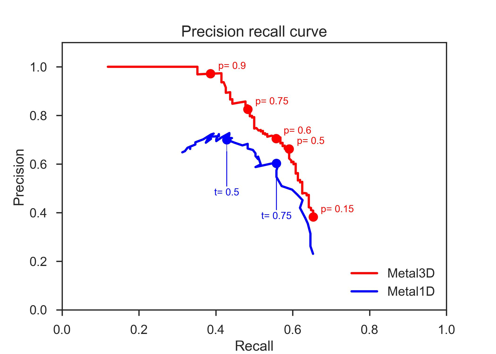

## Additional information 

<!-- ### Acknowledgement -->

### Conflict of interest
None declared

### Author contributions
S.L.D and A.L designed research, S.L.D, A.L, U.R conceptualized research, S.L.D and A.L developed methodology and software, S.L.D and A.L wrote first draft, S.L.D, A.L, U.R revised and edited draft, U.R supervised research and acquired funding.

## Supplement

### Metal1D 

| Amino acid    | Residue name | Label(s) | Search radius increase (Å) |
|:--------------|:------------:|:--------:|:--------------------------:|
| Alanine       | ALA          | O        | 0                          |
| Arginine      | ARG          | NH1, NH2 | 1.2                        |
| Asparagine    | ASN          | OD1      | 0                          |
| Aspartic acid | ASP          | OD1, OD2 | 1.105                      |
| Cysteine      | CYS          | SG       | 0                          |
| Glutamic acid | GLU          | OE1, OE2 | 1.105                      |
| Glutamine     | GLN          | OE1      | 0                          |
| Glycine       | GLY          | O        | 0                          |
| Histidine     | HIS          | ND1, ND2 | 1.08                       |
| Isoleucine    | ILE          | O        | 0                          |
| Leucine       | LEU          | O        | 0                          |
| Lysine        | LYS          | NZ       | 0                          |
| Methionine    | MET          | SD       | 0                          |
| Phenylalanine | PHE          | O        | 0                          |
| Proline       | PRO          | O        | 0                          |
| Serine        | SER          | OG       | 0                          |
| Threonine     | THR          | OG1      | 0                          |
| Tryptophan    | TRP          | O        | 0                          |
| Tyrosine      | TYR          | OH       | 0                          |
| Valine        | VAL          | OH       | 0                          |

Table: Atoms used as reference points for each amino acid in Metal1D. In case of amino acids with more than one possible ligand atom, the search radius is enlarged, the increase is computed from the midpoint between all ligating atoms. Typical values computed for structure data files downloaded from the PDB are reported. {#tbl:metal1dsupplementary}

### Precision/Recall

{#fig:precisionrecall}

### Metal selectivity 

#### Metal1D

{#fig:selectivity-metal1d}

<!-- ToDo update plots from RMSD to MAD -->

{#fig:selectivity-distance-metal1d}

#### Metal3D

{#fig:selectivity-distance-metal3d}

{#fig:selectivity-probability-metal3d}

### Comparison 

{#fig:madonlyGoodZnmetal3d}

##### Mean absolute deviations

The measured MAD for all true positive zinc sites for each tool in the database. 

| tool            |  MAD [Å]             |   median  [Å]|
|:----------------|----------------------:|---------:|
| BioMetAll c=0.5 |          2.72 ± 1.33  |  2.86    |
| MIB t=1.25      |          1.13 ± 1.24  |  0.60    |
| MIB t=1.9       |          0.77 ± 1.09  |  0.44    |
| Metal1D t=0.5   |          2.07 ± 1.33  |  2.06    |
| Metal1D t=0.75  |          2.19 ± 1.26  |  2.12    |
| Metal3D p=0.25  |          0.74 ± 0.66  |  0.61    |
| Metal3D p=0.5   |          0.73 ± 0.66  |  0.54    |
| Metal3D p=0.75  |          0.71 ± 0.64  |  0.51    |
| Metal3D p=0.9   |          0.70 ± 0.64  |  0.52    |

Table: MAD and median on zinc test set for all zinc sites (n=189). {#tbl:compmadmediantest}

| tool            |   MAD [Å]         | median [Å]|
|:----------------|----------------------:|-------:|
| BioMetAll c=0.5 |          2.68 ± 1.33  |  2.84  |
| MIB t=1.25      |          1.09 ± 1.21  |  0.60  |
| MIB t=1.9       |          0.77 ± 1.09  |  0.44  |
| Metal1D t=0.5   |          1.97 ± 1.29  |  1.99  |
| Metal1D t=0.75  |          2.06 ± 1.24  |  2.09  |
| Metal3D p=0.25  |          0.69 ± 0.58  |  0.56  |
| Metal3D p=0.5   |          0.69 ± 0.59  |  0.54  |
| Metal3D p=0.75  |          0.71 ± 0.64  |  0.51  |
| Metal3D p=0.9   |          0.70 ± 0.64  |  0.52  |

Table: MAD and median on zinc test set for zinc sites with at least 2 protein ligands (n=133). {#tbl:compmadmediantestgoodonly}

##### False positive Metal3D p=0.9
{#fig:4jjjFP}
