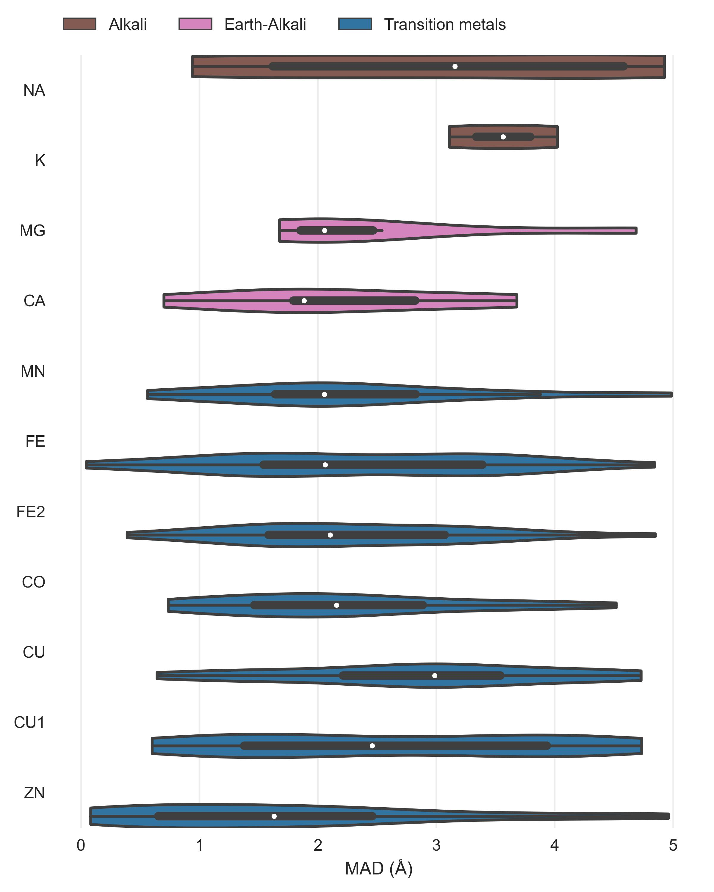

## Additional information 

### Acknowledgement
Supported by Swiss National Science Foundation Grant Number 200020-185092 with computational resources from the Swiss National Computing Centre CSCS.
We thank the developers of [3Dmol.js](https://3dmol.csb.pitt.edu/) and [manubot](https://manubot.org/) that made the interactive version of this manuscript possible.

### Data availibility
Code and training data are available on [lcbc-epfl/metal-site-prediction](https://github.com/lcbc-epfl/metal-site-prediction) and on Zenodo.

### Conflict of interest
None declared

### Author contributions
S.L.D and A.L designed research, S.L.D, A.L, U.R conceptualized research, S.L.D and A.L developed methodology and software, S.L.D and A.L wrote first draft, S.L.D, A.L, U.R revised and edited draft, U.R supervised research and acquired funding.

## Supplement

### Metal1D 

| Amino acid    | Residue name | Label(s) | Search radius increase (Å) |
|:--------------|:------------:|:--------:|:--------------------------:|
| Alanine       | ALA          | O        | 0                          |
| Arginine      | ARG          | NH1, NH2 | 1.2                        |
| Asparagine    | ASN          | OD1      | 0                          |
| Aspartic acid | ASP          | OD1, OD2 | 1.105                      |
| Cysteine      | CYS          | SG       | 0                          |
| Glutamic acid | GLU          | OE1, OE2 | 1.105                      |
| Glutamine     | GLN          | OE1      | 0                          |
| Glycine       | GLY          | O        | 0                          |
| Histidine     | HIS          | ND1, ND2 | 1.08                       |
| Isoleucine    | ILE          | O        | 0                          |
| Leucine       | LEU          | O        | 0                          |
| Lysine        | LYS          | NZ       | 0                          |
| Methionine    | MET          | SD       | 0                          |
| Phenylalanine | PHE          | O        | 0                          |
| Proline       | PRO          | O        | 0                          |
| Serine        | SER          | OG       | 0                          |
| Threonine     | THR          | OG1      | 0                          |
| Tryptophan    | TRP          | O        | 0                          |
| Tyrosine      | TYR          | OH       | 0                          |
| Valine        | VAL          | OH       | 0                          |

Table: Atoms used as reference points for each amino acid in Metal1D. In the case of amino acids with more than one possible ligand atom, the search radius is enlarged, the increase is computed from the midpoint between all ligating atoms. Typical values computed for structure data files downloaded from the PDB are reported. {#tbl:metal1dreferencepoints tag="S1"}

| Channel name    | Selected atoms                                                                                      |
|:----------------|:----------------------------------------------------------------------------------------------------|
| aromatic        | HIS TRP TYR PHE sidechain without CB                                                                |  
| hydrophobic     | element C                                                                                           |
| occupancy       | all protein heavy atoms                                                                             |
| hbond donor     | (ASN GLN TRP MSE SER THR MET CYS and name ND2 NE2 NE1 SG SE OG OG1) and name N                      |
| hbond acceptor  | (resname ASP GLU HIS SER THR MSE CYS MET and name ND2 NE2 OE1 OE2 OD1 OD2 OG OG1 SE SG) or name O   |
| metalbinding    | (name ND1 NE2 SG OE1 OE2 OD2) or (protein and name O N)                                             |
| positive charge | resname LYS ARG HIS and name NZ NH1 NH2 ND1 NE2 NE                                                  |
| negative charge | resname ASP GLU and name OD1 OD2 OE1 OE2                                                            |

Table: Atom selections used for voxelization of proteins using moleculekit {#tbl:voxelchannels tag="S2"}

{#fig:jaccard tag="S1"}

### Precision/Recall

{#fig:precisionrecall tag="S2"}

### Metal selectivity 

#### Metal1D

{#fig:selectivity-metal1d tag="S3"}

{#fig:selectivity-distance-metal1d tag="S4"}

#### Metal3D

{#fig:selectivity-distance-metal3d tag="S5"}

{#fig:selectivity-probability-metal3d tag="S6"}

### Comparison 

{#fig:madonlyGoodZnmetal3d tag="S7"}

##### False positive Metal3D p=0.9
{#fig:4jjjFP tag="S8"}

##### Mean absolute deviations

The measured MAD for all true positive zinc sites for each tool in the database. 

| tool            |  MAD [Å]             |   median  [Å]|
|:----------------|----------------------:|---------:|
| BioMetAll c=0.5 |          2.72 ± 1.33  |  2.86    |
| MIB t=1.25      |          1.13 ± 1.24  |  0.60    |
| MIB t=1.9       |          0.77 ± 1.09  | **0.44**    |
| Metal1D t=0.5   |          2.07 ± 1.33  |  2.06    |
| Metal1D t=0.75  |          2.19 ± 1.26  |  2.12    |
| Metal3D p=0.25  |          0.74 ± 0.66  |  0.61    |
| Metal3D p=0.5   |          0.73 ± 0.66  |  0.54    |
| Metal3D p=0.75  |          0.71 ± 0.64  |  0.51    |
| Metal3D p=0.9   |          **0.70 ± 0.64**  |  0.52    |

Table: MAD and median on zinc test set for all zinc sites (n=189). {#tbl:compmadmediantest tag="S3"}

| tool            |   MAD [Å]         | median [Å]|
|:----------------|----------------------:|-------:|
| BioMetAll c=0.5 |          2.68 ± 1.33  |  2.84  |
| MIB t=1.25      |          1.09 ± 1.21  |  0.60  |
| MIB t=1.9       |          0.77 ± 1.09  |  **0.44**  |
| Metal1D t=0.5   |          1.97 ± 1.29  |  1.99  |
| Metal1D t=0.75  |          2.06 ± 1.24  |  2.09  |
| Metal3D p=0.25  |          0.69 ± 0.58  |  0.56  |
| Metal3D p=0.5   |          0.69 ± 0.59  |  0.54  |
| Metal3D p=0.75  |          0.71 ± 0.64  |  0.51  |
| Metal3D p=0.9   |          **0.70 ± 0.64**  |  0.52  |

Table: MAD and median on zinc test set for zinc sites with at least 2 protein ligands (n=133). {#tbl:compmadmediantestgoodonly tag="S4"}

